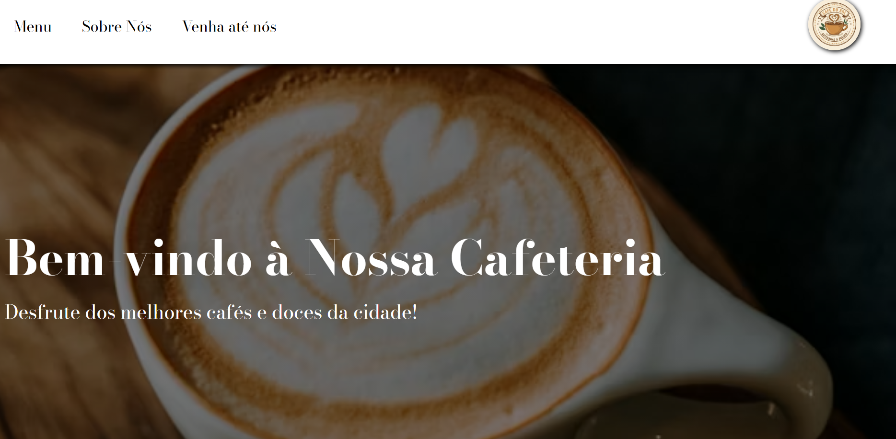

# Cafeteria - Site Institucional



## Demo ao Vivo
[Ver projeto funcionando](https://mbarros-ux.github.io/Cafeteria/)

## Sobre
Site institucional de cafeteria desenvolvido com HTML, CSS e JavaScript puro. Este projeto foi criado para praticar desenvolvimento front-end, incluindo criação de layouts, navegação e formulários.

O site apresenta um design moderno e acolhedor, com seções de cardápio, informações sobre a cafeteria e formulário de contato/reservas.

## Tecnologias Utilizadas
- HTML5 - Estrutura semântica
- CSS3 - Estilização, layouts e design responsivo
- JavaScript - Interatividade e manipulação do DOM

## Funcionalidades
- Layout responsivo (adapta-se a diferentes tamanhos de tela)
- Menu de navegação entre seções
- Seção de cardápio com produtos
- Formulário de contato/reservas (frontend)
- Interface otimizada para mobile e desktop
- Design visual atraente e profissional

## Como Executar

1. Clone este repositório:
```bash
git clone https://github.com/mbarros-ux/Cafeteria.git
```
 2. Abra o arquivo ```index.html``` em seu navegador.
